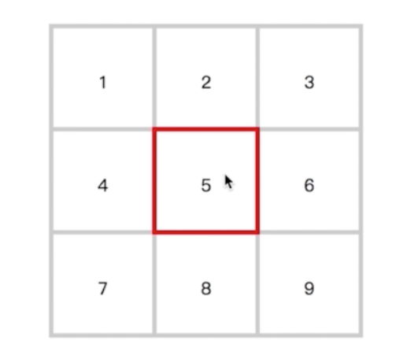

### 从九宫格考察CSS综合实力



1、reset.css（因浏览器背后有不同样式，重置浏览器默认样式）

2、采取合理的dom结构，体现html语义化（ul>li或dl>dd）

解决方案详见`combat-1.html`

考察的综合实力：
    1、flex布局
    2、box-sizing
    3、css选择器
    4、z-index巧用
    5、负边距

### 一个函数考察js的基本功

```javascript
function Foo() {
    getName = function() {console.log(1)};
    return this;
}
Foo.getName = function() {console.log(2)};
Foo.prototype.getName = function() {console.log(3)};
var getName = function() {console.log(4)};
function getName() {console.log(5)} // 函数声明提升

Foo.getName(); //2
getName(); //4
Foo().getName(); //1
getName(); //1
// 运算符操作的优先级
new Foo.getName(); //2

// new function() {console.log(2)}()

new Foo().getName(); //3
new new Foo().getName(); //3
```
考察点：
    函数和类
    原型链
    运算符优先级
    作用域
    变量提升

### 使用面向对象的方式维护一个列表，每个列表有一个删除按钮，点击删除按钮移除当前行


答案详见`combat-2.html`

考察点：
    复用性设计
    事件代理
    事件绑定
    渲染机制
    递归

### 一道JS算法提升软实力

```javascript
    // 扁平化输出
    // 输入：['a', ['b', 'c'], 2, ['d', 'e', 'f'], 'g', 3, 4]
    // 输出： a, b, c, 2, d, e, f, g, 3, 4

    // 解法一：递归
    function flat (array) {
        var result = [];
        var each = function(arr) {
            arr.forEach(item => {
                if (item instanceof Array) {
                    each(item);
                } else {
                    result.push(item);
                }
            });
            each(array);
            return result.join(',');
        }
    } 

    // 解法二：toString格式转换
    // ?? Array.prototype.toString可以直接返回扁平化结果
    function flat2 (array) {
        let toString = Array.prototype.toString;
        Array.prototype.toString = function() {
            return this.join(',');
        };
        let result = array + '';
        Array.prototype.toString = toString;
        return result;
    }

    // 解法三：隐式类型转换，数组与字符串相加是先调用valueOf，如果不是基本类型再调用toString，所以也可以通过重写valueOf来做格式转换

    function flat3 (array) {
        let valueOf = Array.prototype.valueOf;
        Array.prototype.valueOf = function() {
            return this.join(',');
        };
        let result = array + '';
        Array.prototype.valueOf = valueOf;
        return result;
    }

    // 解法四：遍历器Iterator
    Array.prototype[Symbol.iterator] = function () {
        let arr = [].concat(this);
        let getFirst = function (array) {
            let first = array.shift();
            return first;
        };
        return {
            next: function () {
                let item = getFirst(arr);
                if (item) {
                    return {
                        value: item, // 关键：这里有个隐式类型转换，当item为数组时转化为字符串
                        done: false
                    } 
                } else {
                    return {
                        done: true
                    }
                }
            }
        }
    };

    var flat4 = function (arr) {
        let r= [];
        for (let i in arr) { r.push(i) }
        return r.join(',');
    }
```
考察点：递归、隐式类型转换、遍历器


