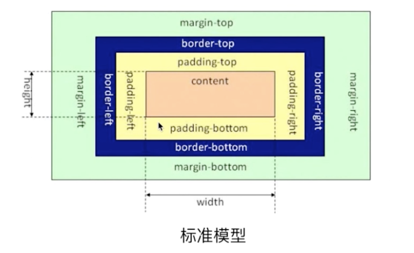
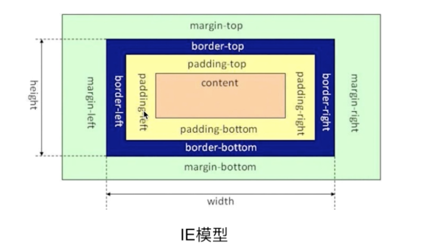

## CSS盒模型

### 基本概念：标准模型+IE模型





### 标准模型和IE模型的区别

宽度和高度计算却别：标准模型宽度和高度只计算content，IE模型宽高包含border和padding

### CSS如何设置这两种模型

```
    box-sizing: content-box; // 默认
    box-sizing: border-box;
```

### JS如何获取模型对应的宽度

```
    dom.style.height/width; // 只能取出内联样式的宽和高
    dom.currentStyle.height/width; // 只IE支持
    window.getComputedStyle(dom).height/width; // 兼容性更好
    dom.getBoundingClientRect().height/width; // 该API主要用于获取绝对位置

```

### 实例题（根据盒模型解释边距重叠）

父子元素边距重叠

兄弟元素边距重叠：取两者边距的最大值

空元素边距重叠：空元素设置设置上边距和下边距，会取两者的最大值

### BFC（边距重叠解决方案）、IFC

BFC的基本概念：块级格式化上下文
原理（渲染规则）：
    1、BFC元素垂直方向的边距会发生重叠
    2、BFC的区域不会与浮动元素的box重叠，用于清除浮动
    3、BFC是独立容器，外面不会影响里面元素，里面也不会影响外面元素
    4、计算BFC高度，浮动元素也会参与计算
如何创建BFC：
    1、float值不为none的，默认float值none，只要设置了float值不为none就创建了BFC
    2、position值：默认为static，只要position不为static或relative就创建了BFC
    3、display属性为inline-box、table、table-ceil等
    4、overflow不为visible时，overflow为auto、hidden都可以创建
BFC使用场景：

IFC的基本概念：内联元素格式化上下文
