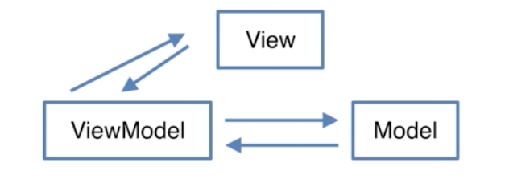
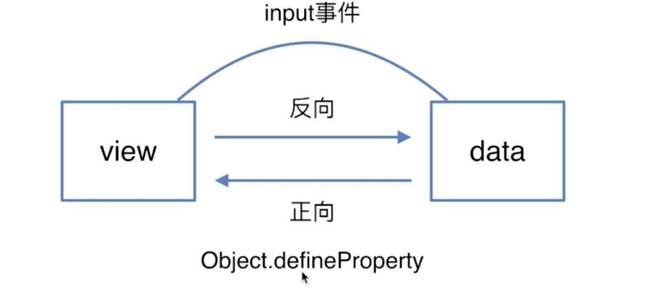
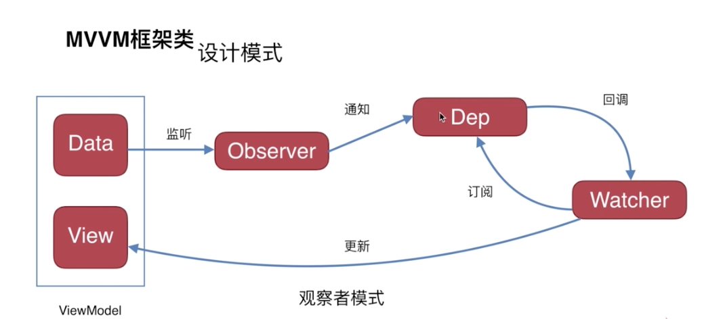

### MVVM

可以专注了解一个，如VUE

#### 了解MVVM框架吗

    Vue.js
    React.js
    Angular.js

#### 谈谈你对MVVM的认识

MVC：Model、View、Controller

MVVM：

MVVM和MVC的区别

#### 双向绑定是什么原理，写代码

正向：data-》view 数据驱动页面
反向：view-》data 自动化处理页面改变到数据

1、Object.defineProperty用法
2、Object.defineProperty和reflect.defineProperty的区别
    Object.defineProperty返回新对象，reflect.defineProperty返回布尔值
3、手写Object.defineProperty

#### 使用了什么设计模式

#### 生命周期是什么

Vue的生命周期示意图

#### 有看过源码吗