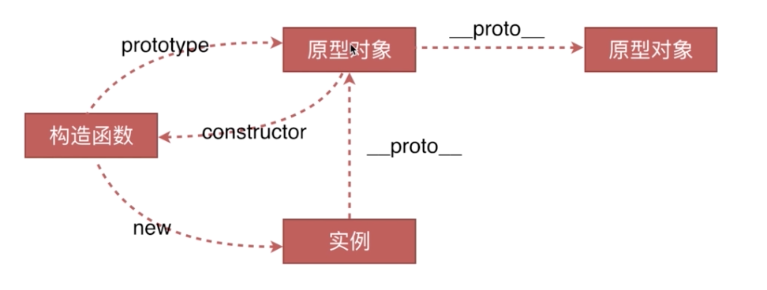
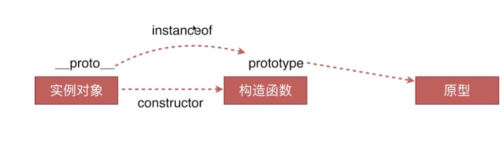

### 原型链

#### 创建对象的几种方法
```javascript
    // 1、字面量
    var o1 = {name: '1'};
    var o11 = new Object({name: '1'});
    // 2、构造函数
    var M = function(name){this.name = name};
    var o2 = new M('2');
    // 3、Object.create
    var P = {name: '3'};
    var o3 = Object.create(P);
```

#### 原型、构造函数、实例、原型链



函数才有prototype对象是没有prototype的

#### instanceof的原理



看实例对象的__proto__和构造函数的prototype是不是同一个引用地址

在同一条原型链上的实例对象instanceof返回都是true，用constructor判断更严谨

#### new运算符

先创建一个空对象，继承自构造函数的原型；
构造函数被执行，同时上下文被修改指向新实例；
返回，如果构造函数有返回对象，代替new出来的结果返回

```javascript
var new2 = function(func) {
    var o = Object.create(func.prototype); // Object.create参数作为新对象的原型对象
    var k = func.call(o);
    if (typeof k === 'object') {
        return k;
    } else {
        return o;
    }
}
```


