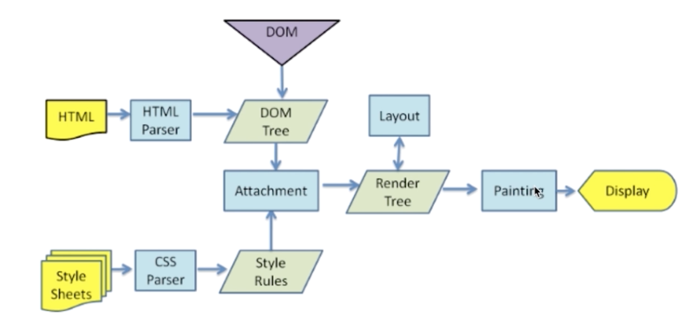
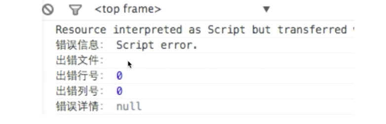

### 渲染机制

#### 什么是DOCTYPE及作用

DTD（document type definition，文档定义类型），是一系列的语法规则，用来定义XML或(X)HTML的文件类型。浏览器会使用它来判断文档类型，决定使用何种方式来解析，以及切换浏览器模式。

DOCTYPE是用来声明文档类型和DTD规范d额，一个主要用途是文档合法性验证，如果文件代码不合法，那么浏览器解析时会出现以下差错。

#### 浏览器渲染过程

DOM Tree
            -> Render Tree  +  layout  -> painting
CSSOM Tree

#### 重拍reflow

定义：DOM结构中每个元素都有自己的盒子模型，这些都需要浏览器根据各种样式来计算并根据计算结果将元素放到它该出现的位置，这个过程称之为reflow

触发：
1、增加、删除、修改DOM结点
2、移动DOM位置，或搞动画
3、修改CSS样式时有可能会导致reflow
4、resize窗口，或滚动的时候
5、当修改网页的默认字体时

#### 重绘repaint

定义：当各种盒子的位置、大小以及其他属性，例如颜色、字体大小等都确定下来后，浏览器便把这些元素都按照各自的特性绘制一遍，于是页面的内容出现了，这个过程称之为repaint

触发：DOM改动，CSS变动

如何避免最小程度的repaint：利用DocumentFragment多个结点修改合并成一个结点

#### 布局layout

### JS运行机制

如何理解JS单线程
同步任务、异步任务，什么是任务队列
什么是Event Loop

哪些语句放到异步队列中，语句放入异步队列的时机

什么时候开启异步任务：setTimeout、setInterval、DOM事件、ES6中的Promise

### 页面性能

#### 提升页面性能的方法

1、资源压缩合并，减少http请求
2、非核心代码异步加载 -》 异步加载的方式 -》 异步加载的区别

    异步加载方式：动态脚本加载、defer、async
    异步加载的区别：
    defer是HTML解析完成后才会执行，如果是多个，按照加载顺序依次执行
    async是在加载完成立即执行，如果多个，执行顺序和加载顺序无关

3、利用浏览器缓存 -》 缓存的分类 -》 缓存的原理
缓存的分类：
- 强缓存

**Expires** Expires:Thu,21 Jan 2017 23:39:02 GMT
**Catch-Control** Catch-Control:max-age=3600

Expires服务器绝对时间（有可能因为客户端时间和服务器时间不一致导致不缓存），Catch-Control客户端相对时间
两个时间都下发，以Catch-Control为准

- 协商缓存

**Last-Modified** Last-Modified:Web,26 Jan 2017 00:35:11 GMT
**If-Moodified-Since** Last-Modified:Web,26 Jan 2017 00:35:11 GMT

**Etag**
**If-None-Match**

和缓存相关的请求头有哪些：如上

4、CDN
5、DNS预解析
    <meta http-equiv="x-dns-prefetch-control" content="on">
    <link rel="dns-prefetch" href="//host_name_to_prefetch.com">

    http页面，很多浏览器是默认a标签开启DNS预解析的，但是https页面，很多浏览器是默认关闭的，需要加上上面第一句打开a标签dns预解析

### 错误监控

#### 前端错误分类

即时运行错误
资源记载错误

#### 错误的捕获方式

即时运行错误：
    1）try...catch; 
    2）window.onerror （window.onerror无法捕获资源加载错误，因为script、img等onerror错误不冒泡，无法触发window下的onerror事件）

资源记载错误：
    1）object.onerror（如图片img.onerror，script标签）
    2）performance.getEnries()   获取所有资源加载时长
    3）error事件捕获
        onerror不冒泡但是可以捕获

    window.addEventListener('error', function(e){ console.log('捕获', e)}, true);

跨域的js运行错误可以捕获吗？错误提示是什么，应该怎么处理

可以捕获，

处理方式：
1、客户端在script标签增加crossorigin属性
2、服务器端设置js资源响应头Access-Control-Allow-Origin:*

#### 上报错误的基本原理

1、采用ajax通信方式上报
2、navigator.sendBeacon 优于ajax  [参考文档](https://developer.mozilla.org/zh-CN/docs/Web/API/Navigator/sendBeacon)
3、利用image对象上报
    (new Image()).src = 'http://www.baidu.com/test?tttt=1';

