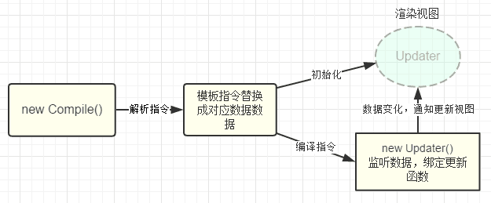

VUE实现数据双向绑定原理
======

详细介绍转[https://github.com/DMQ/mvvm](https://github.com/DMQ/mvvm)，这里只是阅读笔记做了记录

#### 实现数据绑定的通用方法有

- 发布者-订阅者模式（backbone.js）
- 脏值检查（angular.js）
- 数据劫持（vue.js）

vue.js 是采用数据劫持结合发布者-订阅者模式的方式，通过Object.defineProperty()来劫持各个属性的setter，getter，在数据变动时发布消息给订阅者，触发相应的监听回调。

**实现MVVM双向数据绑定需要实现以下几点：**
1、实现一个数据监听器Observer，能够对数据对象的所有属性进行监听，如有变动可拿到最新值并通知订阅者；
2、实现一个指令解析器Compile，对每个元素节点的指令进行扫描和解析，根据指令模板替换数据，以及绑定相应的更新函数；
3、实现一个Watcher，作为连接Observer和Compile的桥梁，能够订阅并收到每个属性变动的通知，执行指令绑定的相应回调函数，从而更新视图
4、mvvm入口函数


##### 实现Observer

通过`Obeject.defineProperty()`来监听属性变动，将需要observe的数据对象进行递归遍历，包括子属性对象的属性，都加上`getter`和`setter`，给这个对象的某个属性赋值，就会触发`setter`，就可以监听到数据变化了。

```javascript
var data = {name: 'jin'};
observe(data);
data.name = 'Jin';

function observe(data) {
    if (!data || typeof data != 'object') {
        return;
    }
    Object.keys(data).forEach(function(key){
        defineReactive(data, key, data[key]);
    });
};

function defineReactive(data, key, val) {
    observe(val);
    Object.defineProperty(data, key, {
        enumerable: true,
        configurable: false,
        get: function() {
            return val;
        },
        set: function(newVal) {
            val = newVal;
        }
    })
}
```

这样我们已经可以监听每个数据的变化了，那么监听到变化之后就是怎么通知订阅者了，所以接下来我们需要实现一个消息订阅器，很简单，维护一个数组，用来收集订阅者，数据变动触发notify，再调用订阅者的update方法，代码改善之后是这样：

```javascript
function defineReactive(data, key, val) {
    var dep = new Dep();
    observe(val); // 监听子属性
    Object.defineProperty(data, key, {
        // ...
        set: function(newVal) {
            if (val === newVal) return;
            val = newVal;
            dep.notify();
        }
    });
}

function Dep() {
    this.subs = [];
}

Dep.prototype = {
    addSub: function(sub) {
        this.subs.push(sub);
    },
    notify: function() {
        this.subs.dorEach(function(sub){
            sub.update();
        })
    }
}
```

那么问题来了，谁是订阅者？怎么往订阅器添加订阅者？ 没错，上面的思路整理中我们已经明确订阅者应该是Watcher, 而且`var dep = new Dep();`是在`defineReactive`方法内部定义的，所以想通过dep添加订阅者，就必须要在闭包内操作，所以我们可以在`getter`里面动手脚：

```javascript
// Observer.js
// ...

Object.defineProperty(data, key, {
    // ...
    get: function() {
        Dep.target && dep.addSub(Dep.target);
        return val;
    }
});

// Watcher.js

Watch.prototype = {
    get: function(key) {
        Dep.target = this;
        this.value = data[key]; // 这里会触发属性的getter，从而添加订阅者
        Dep.target = null;
    }
}

```

这里已经实现了一个Observer了，已经具备了监听数据和数据变化通知订阅者的功能

##### 实现Compile

compile主要做的事情是解析模板指令，将模板中的变量替换成数据，然后初始化渲染页面视图，并将每个指令对应的节点绑定更新函数，添加监听数据的订阅者，一旦数据有变动，收到通知，更新视图，如图所示：



因为遍历解析的过程有多次操作dom节点，为提高性能和效率，会先将跟节点el转换成文档碎片`fragment`进行解析编译操作，解析完成，再将`fragment`添加回原来的真实dom节点中

```javascript
function Compile(el) {
    this.$el = this.isElementNode(el) ? el : document.querySelector(el);
    if (this.$el) {
        this.$fragment = this.node2fragment(this.$el);
        this.init();
        this.$el.appendChild(this.$fragment);
    }
}

Compile.prototype = {
    init: function() {
        this.compileElement(this.$fragment);
    },
    node2fragment: function(el) {
        var fragment = document.createDocumentFragment(), child;
        
    }
};
```